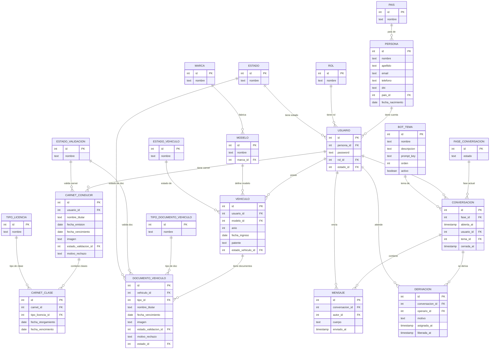

# Mapeo de Base de Datos — GoVehiculos

Diagrama ERD físico generado desde `init.sql`.
Renderizable en GitHub, GitLab, Notion, o cualquier editor que soporte Mermaid.

```mermaid
erDiagram

    PAIS {
        int id PK
        text nombre
    }

    ROL {
        int id PK
        text nombre
    }

    ESTADO {
        int id PK
        text nombre
    }

    ESTADO_VEHICULO {
        int id PK
        text nombre
    }

    ESTADO_VALIDACION {
        int id PK
        text nombre
    }

    PERSONA {
        int id PK
        text nombre
        text apellido
        text email
        text telefono
        text dni
        int pais_id FK
        date fecha_nacimiento
    }

    USUARIO {
        int id PK
        int persona_id FK
        text password
        int rol_id FK
        int estado_id FK
    }

    MARCA {
        int id PK
        text nombre
    }

    MODELO {
        int id PK
        text nombre
        int marca_id FK
    }

    VEHICULO {
        int id PK
        int usuario_id FK
        int modelo_id FK
        int anio
        date fecha_ingreso
        text patente
        int estado_vehiculo_id FK
    }

    TIPO_LICENCIA {
        int id PK
        text nombre
    }

    CARNET_CONDUCIR {
        int id PK
        int usuario_id FK
        text nombre_titular
        date fecha_emision
        date fecha_vencimiento
        text imagen
        int estado_validacion_id FK
        text motivo_rechazo
    }

    CARNET_CLASE {
        int id PK
        int carnet_id FK
        int tipo_licencia_id FK
        date fecha_otorgamiento
        date fecha_vencimiento
    }

    TIPO_DOCUMENTO_VEHICULO {
        int id PK
        text nombre
    }

    DOCUMENTO_VEHICULO {
        int id PK
        int vehiculo_id FK
        int tipo_id FK
        text nombre_titular
        date fecha_vencimiento
        text imagen
        int estado_validacion_id FK
        text motivo_rechazo
        int estado_id FK
    }

    BOT_TEMA {
        int id PK
        text nombre
        text descripcion
        text prompt_key
        int orden
        boolean activo
    }

    FASE_CONVERSACION {
        int id PK
        text estado
    }

    CONVERSACION {
        int id PK
        int fase_id FK
        timestamp abierta_at
        int usuario_id FK
        int tema_id FK
        timestamp cerrada_at
    }

    MENSAJE {
        int id PK
        int conversacion_id FK
        int autor_id FK
        text cuerpo
        timestamp enviado_at
    }

    DERIVACION {
        int id PK
        int conversacion_id FK
        int operario_id FK
        text motivo
        timestamp asignada_at
        timestamp liberada_at
    }

    %% Relaciones

    PAIS               ||--o{ PERSONA            : "país de"
    PERSONA            ||--o{ USUARIO            : "tiene cuenta"
    ROL                ||--o{ USUARIO            : "tiene rol"
    ESTADO             ||--o{ USUARIO            : "tiene estado"

    USUARIO            ||--o{ VEHICULO           : "posee"
    MARCA              ||--o{ MODELO             : "fabrica"
    MODELO             ||--o{ VEHICULO           : "define modelo"
    ESTADO_VEHICULO    ||--o{ VEHICULO           : "estado de"

    USUARIO            ||--o{ CARNET_CONDUCIR    : "tiene carnet"
    ESTADO_VALIDACION  ||--o{ CARNET_CONDUCIR    : "valida carnet"
    CARNET_CONDUCIR    ||--o{ CARNET_CLASE       : "contiene clases"
    TIPO_LICENCIA      ||--o{ CARNET_CLASE       : "tipo de clase"

    VEHICULO           ||--o{ DOCUMENTO_VEHICULO : "tiene documentos"
    TIPO_DOCUMENTO_VEHICULO ||--o{ DOCUMENTO_VEHICULO : "tipo de doc"
    ESTADO_VALIDACION  ||--o{ DOCUMENTO_VEHICULO : "valida doc"
    ESTADO             ||--o{ DOCUMENTO_VEHICULO : "estado de doc"

    FASE_CONVERSACION  ||--o{ CONVERSACION       : "fase actual"
    USUARIO            ||--o{ CONVERSACION       : "inicia"
    BOT_TEMA           ||--o{ CONVERSACION       : "tema de"
    CONVERSACION       ||--o{ MENSAJE            : "contiene"
    USUARIO            ||--o{ MENSAJE            : "envía"
    CONVERSACION       ||--o{ DERIVACION         : "se deriva"
    USUARIO            ||--o{ DERIVACION         : "atiende"
```
